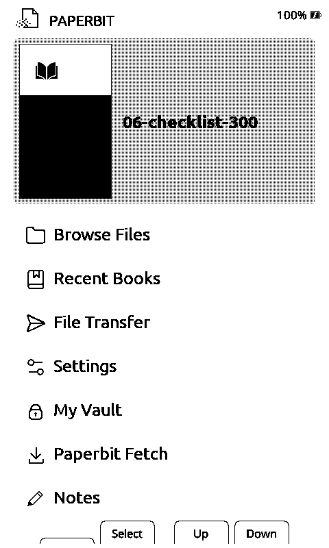

# PaperBit

**Turn a $60 e-ink reader into a distraction-free Markdown reader and Bluetooth typewriter — with wireless updates.**

> **Personal project.** I build this for my own use; issues are welcome, response times vary.
> See [CONTRIBUTING.md](CONTRIBUTING.md) before filing.

PaperBit is custom firmware for the **Xteink X4** (and X3) e-ink reader — an ESP32-C3 device with a
480×800 e-paper panel and physical page buttons. It is a fork of the excellent
[CrossPoint Reader](https://crosspointreader.com) (MIT, © 2025 Dave Allie) that keeps everything
CrossPoint does well — EPUB reading, 4-level grayscale, fast partial refresh, OPDS — and adds a
Markdown-first workflow: read `.md` files natively on-device, pull them over Wi-Fi from any folder
you control, and write new ones on a Bluetooth keyboard.



## Features

- **Native Markdown reader** — open `.md` files directly on the device. No conversion, no companion
  app required. Streaming parser, book-style pagination, reading position saved and restored.
- **Table of contents** — every `#` and `##` heading becomes a TOC entry; press Open while reading
  to jump to any section.
- **Paperbit Fetch** — point the device at any web folder (a plain HTTP directory) and pull
  documents over Wi-Fi: shopping lists, daily digests, saved articles. An `index.json` is
  optional — a bare Apache directory listing works.
- **Notes: a Bluetooth typewriter** — pair a BLE keyboard once, then type plain-Markdown notes that
  save continuously as you go. Typewriter model: append, Backspace, Enter. Notes are ordinary `.md`
  files, so every note is also a readable document.
- **Wireless OTA updates** — check for updates from Settings; the device restarts, installs with
  on-screen progress, and boots the new version. Dual A/B firmware slots mean a failed update
  leaves the old firmware bootable.
- **My Vault** — PIN-protected notes, AES-256-GCM encrypted on the SD card.
- **Everything CrossPoint has** — EPUB / TXT / XTC reading, 4-level grayscale, tiered refresh,
  Wi-Fi file transfer (browser + WebDAV), OPDS library support, custom fonts and sleep screens.
- **USB file-transfer protocol** — a `CMD:FT:*` serial protocol for host tooling: full SD
  filesystem access, CRC-checked transfers, and brick-safe firmware install over the cable alone.

## Supported hardware

| Device | Panel | Notes |
|---|---|---|
| Xteink **X4** | SSD1677, 480×800 | Primary target |
| Xteink **X3** | UC81xx, 528×792 | Supported — one universal binary, hardware detected at boot |

Both are ESP32-C3 (no PSRAM, ~380 KB total heap). That constraint shapes the whole design: no DOM,
streamed parsing, banded rendering, hard caps, pages serialized to SD.

## Quick start

1. **Flash the firmware** — see [FLASHING.md](FLASHING.md). If your device already runs CrossPoint
   or PaperBit, the easiest path is copying `firmware.bin` to the SD card and using
   Settings → System → SD Firmware Update.
2. **Join Wi-Fi** — Settings → Wi-Fi. (The ESP32-C3 is 2.4 GHz only.)
3. **Get content on it:**
   - Drop `.md` / `.epub` / `.txt` files on the SD card, or
   - Use the **Paperbit desktop app** over USB, or the device's **File transfer** mode from a
     browser, or
   - Set a **Paperbit Fetch** source URL and pull documents over Wi-Fi (see below).
4. **Type:** pair a BLE keyboard in Settings → Keyboard, then open **Notes** from Home.

### Setting up Paperbit Fetch

Fetch pulls from a single folder URL you control. Any web server that serves a directory listing
over plain HTTP works — see [SERVER-KIT.md](SERVER-KIT.md) for a complete self-hosting guide
(folder layout, optional `index.json`, the OTA release feed, and the capture write API).

Set the URL from the desktop app (Settings → device Fetch URL), from the device's web Settings
page, or on-device via Paperbit Fetch → Set source URL. Then open **Paperbit Fetch** from Home,
pick a document, and it downloads and opens. Supported: `.md`, `.epub`, `.txt`, `.xtc`.

## What the Markdown reader renders

Headings (bold, centered; `#`/`##` feed the TOC), **bold** / *italic* / ~~strikethrough~~, bulleted
and numbered lists, blockquotes, horizontal rules, and links (the label is underlined; the URL is
printed as a page footnote).

Current limits — stated so you don't have to discover them:

- Headings are one size (no size hierarchy yet — this needs new font-size engine work).
- Inline and fenced code render in *italic* (no monospace face yet).
- Images show as an `[Image: alt]` placeholder in Markdown (EPUB images render normally).
- Task-list checkboxes show as literal `[ ]` / `[x]` text, not interactive controls.

Oversized or unsupported content **fails loud**: you get a visible marker or a "Content truncated"
notice, never a silent blank page.

## Security posture — read this before filing the HTTPS issue

**Device-side HTTP is plain `http://` by design.** This is a deliberate, measured decision, not an
oversight:

- The ESP32-C3 in this firmware has roughly **30–45 KB** as its largest contiguous free heap block
  mid-session. mbedTLS (as compiled into the precompiled Arduino cores, not tunable at runtime)
  needs **16 KB + 16 KB contiguous I/O buffers** for a TLS session. In-session TLS is structurally
  infeasible on this hardware with this feature set — it fails, reproducibly, on real devices.
- **Therefore your server must serve the Fetch folder and the OTA feed over plain HTTP, without
  redirecting to HTTPS.** An `http→https` redirect breaks the device. (Browsers and the desktop
  app can keep using HTTPS on the same host.)

**Threat model: a trusted LAN and a server you control.** On an untrusted network, anyone in a
position to intercept your HTTP traffic can see what the device fetches and could tamper with it.
What protects the update path specifically:

- Every firmware image is **validated before flashing** (magic bytes, structure, size, SHA-256).
- **Dual A/B slots** — the running firmware, bootloader, and partition table are never touched;
  a failed or tampered install leaves the old firmware bootable.
- The device's version gate only accepts a release whose `major.minor.patch` is newer.
- **SHA-256 verification against the release feed** (since 1.4.17): the downloaded image is hashed
  and compared to the feed-published `sha256` before flashing; a mismatch refuses to install.

Content you fetch is your own Markdown; the Vault is AES-256-GCM encrypted at rest regardless of
transport. If your threat model includes a hostile local network, don't point the device at it.

## Updating

- **Wireless:** Settings → Check for updates. The device fetches the release feed, restarts, and
  installs with on-screen progress ("reboot-to-install" — the download and flash happen at early
  boot while the heap is pristine). Failures are shown on-screen and the device boots the current
  version.
- **From a computer:** the Paperbit desktop app installs firmware over USB with a validated
  manifest (SHA-256, size, target device) — no Wi-Fi needed.

## Building from source

Requirements: [PlatformIO](https://platformio.org/) (CLI or IDE), Git.

```powershell
# PaperBit lives on the `paperbit` branch of this fork; --recursive pulls the open-x4-sdk submodule
git clone --recursive -b paperbit https://github.com/chippwalters/crosspoint-reader.git
cd crosspoint-reader

# Windows only — REQUIRED, or the build silently appears to hang (cp1252 decode):
$env:PYTHONUTF8 = '1'

pio run -e default        # standard build (serial logging on)
pio run -e ble            # Notes / BLE keyboard build — the shipped flavor
```

```bash
# macOS / Linux
export PYTHONUTF8=1       # harmless outside Windows; the hang is a Windows code-page issue
pio run -e ble
```

| Env | What it is |
|---|---|
| `default` | Daily build — serial log on, no BLE |
| `ble` | `-DENABLE_BLE_KEYBOARD` + NimBLE-Arduino — Notes and keyboard pairing. **The shipped flavor.** |
| `slim` | Smallest build, serial log off |

Artifacts land in `.pio/build/<env>/firmware.bin` (app image, offset `0x10000`), with a
`firmware.manifest.json` emitted next to it by a post-build script. Flash over USB with:

```powershell
pio run -e ble -t upload --upload-port COM7        # Windows
```

```bash
pio run -e ble -t upload --upload-port /dev/ttyACM0   # Linux/macOS
```

The device enumerates as a native USB-Serial/JTAG CDC port (no driver needed on modern OSes).
Serial monitor is 115200 baud. Note: deep sleep removes the USB port entirely — wake the device
if it disappears.

## Documentation

The full **user manual** ships in this repo: [`docs/manual/PAPERBIT-MANUAL.md`](docs/manual/PAPERBIT-MANUAL.md)
— buttons & navigation, every format, Fetch, Notes, settings, updating, troubleshooting. (It's
also readable on the device itself as *PaperBit Manual*.) Third-party attributions: [`NOTICE.md`](NOTICE.md).

## Companion apps

- **[Paperbit (desktop)](https://github.com/chippwalters/x4-client)** — Windows companion
  (Electron, portable ZIP): USB transfer and conversion (including PDF→EPUB), whole-device
  backup/restore, firmware install over the cable, sleep screens, device screenshots.
- **[PaperBit Capture](https://github.com/chippwalters/x4-mobile)** (Android) — share or paste
  from any app, convert to Markdown, publish straight into your Fetch folder.

## Attribution

PaperBit stands on other people's good work:

- **[CrossPoint Reader](https://crosspointreader.com)** — Dave Allie (MIT). The base firmware:
  the EPUB layout engine, grayscale + refresh system, UI framework, display drivers, web server,
  OPDS, and OTA. PaperBit is a fork, not a rewrite.
- **papyrix-reader `lib/Markdown`** — Dave Allie (MIT, same author). The streaming Markdown
  tokenizer (`md_parser`) vendored as the base of the native reader. It is a hand-rolled parser —
  not md4c.
- **MicroSlate firmware** — Josh-writes (MIT). Reference for the BLE keyboard host
  (`BleKeyboardManager` was ported from it).
- **[NimBLE-Arduino](https://github.com/h2zero/NimBLE-Arduino)** — h2zero (Apache-2.0). The BLE
  stack behind Notes.
- **open-x4-sdk** — the Xteink community SDK (display/HAL primitives), vendored as a forked
  submodule.

## License

MIT — the same license as upstream CrossPoint Reader. See [LICENSE](LICENSE).
PaperBit's additions are © their contributors and released under the same terms.
